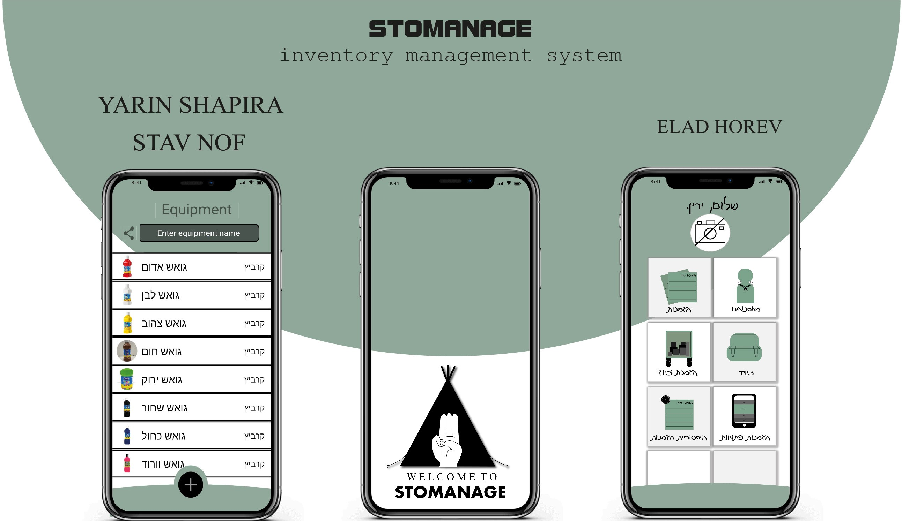

░██████╗████████╗░█████╗░███╗░░░███╗░█████╗░███╗░░██╗░█████╗░░██████╗░███████╗
██╔════╝╚══██╔══╝██╔══██╗████╗░████║██╔══██╗████╗░██║██╔══██╗██╔════╝░██╔════╝
╚█████╗░░░░██║░░░██║░░██║██╔████╔██║███████║██╔██╗██║███████║██║░░██╗░█████╗░░
░╚═══██╗░░░██║░░░██║░░██║██║╚██╔╝██║██╔══██║██║╚████║██╔══██║██║░░╚██╗██╔══╝░░
██████╔╝░░░██║░░░╚█████╔╝██║░╚═╝░██║██║░░██║██║░╚███║██║░░██║╚██████╔╝███████╗
╚═════╝░░░░╚═╝░░░░╚════╝░╚═╝░░░░░╚═╝╚═╝░░╚═╝╚═╝░░╚══╝╚═╝░░╚═╝░╚═════╝░╚══════╝
## Introduction
Our inventory management system will allow the organization of a complete and broad picture of the inventory when counting inventory, will enable ordering and signing equipment with the help of a user-friendly app that allows full transparency in real-time for all users. 
Also, the system alerts and signals to the staff members when inventory is about to run out and produces outputs that will help the organization become more efficient, such as what equipment runs out the fastest, which is ordered the most, or is destroyed the fastest, etc.

